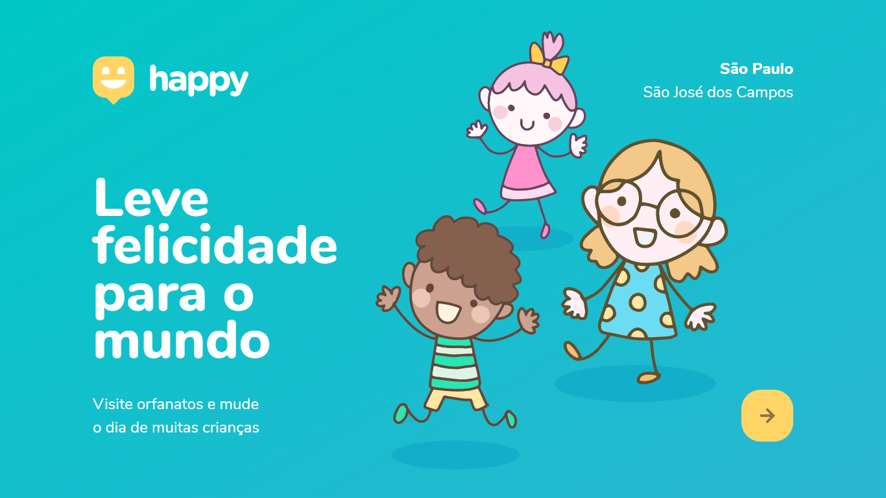

# Projeto de Curso NLW (Next Level Week) by Rocketseat. 

##### Uma semana de imerção ao React e JavaScript como objetivos de melhorar minhas habilidades técnicas (Hard-Skills), em especial, habilidades técnicas relacionadas ao Front-end.

##### Esse é um projeto guiado por instrutores da Rockseat e que tem como objetivo central, o desenvolvimento de uma aplicação web e torná-la disponível para o público de modo geral. O tema desse projeto será revelado neste repositório somente ao final do curso por questão de confidencialidade definida pelos organizadores.

\

*Tecnologias utilizadas nesse projeto:*

- HTML 5
- CSS3
- JavaScript
- NodeJS
- SQL
- Git
- Figma
- Heroku
- Discord

*Social Networking*

- [LinkedIn](https://www.linkedin.com/in/releasesolutions/)
- [Facebook](https://www.facebook.com/robsoncartes/)
- [Twitter](https://twitter.com/robson_cartes)
- [Instagram](https://www.instagram.com/robsoncartes/)
- [Youtube](https://www.youtube.com/robsoncartes)
- Email: robsoncartes@outlook.com
